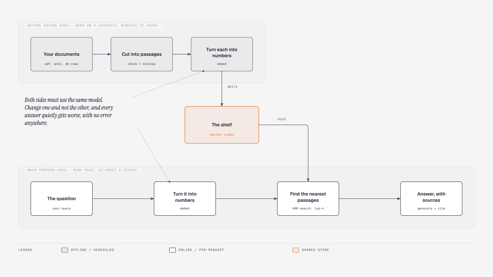
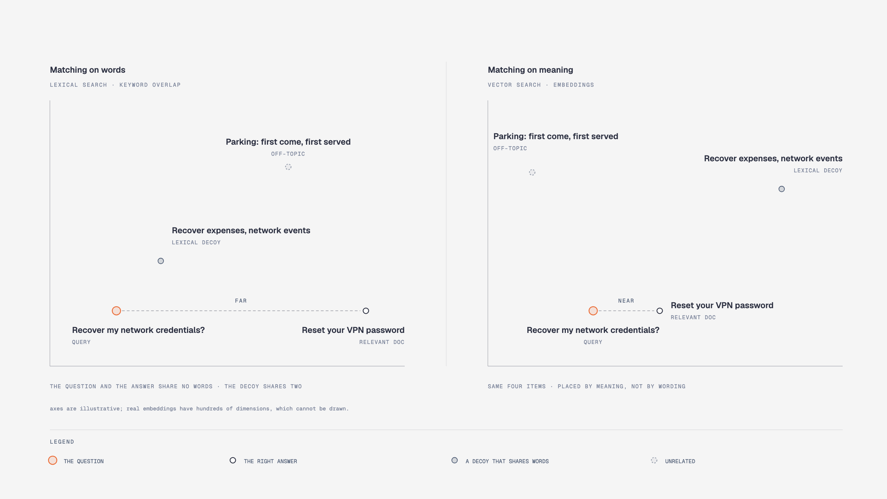
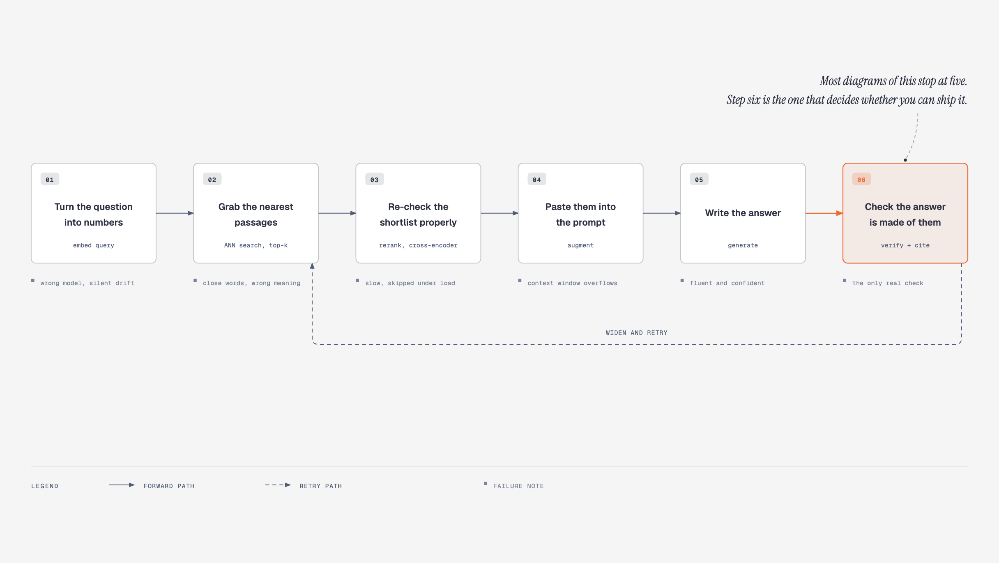
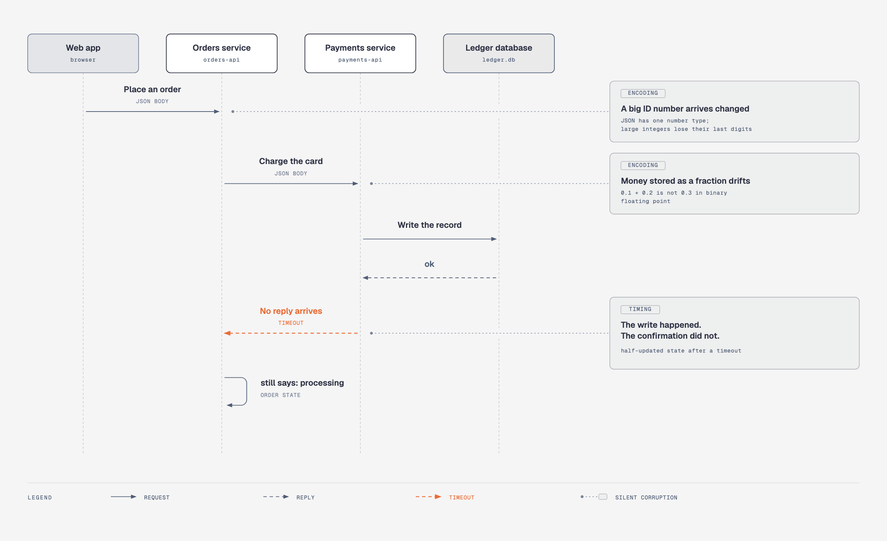
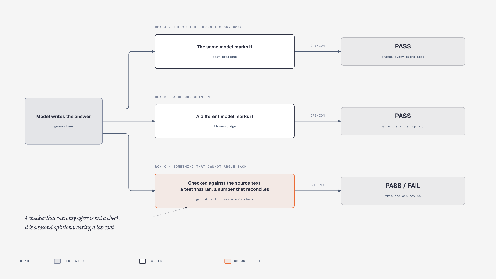
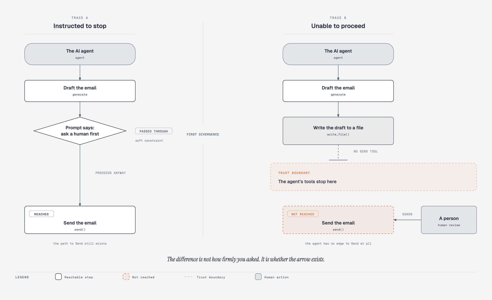
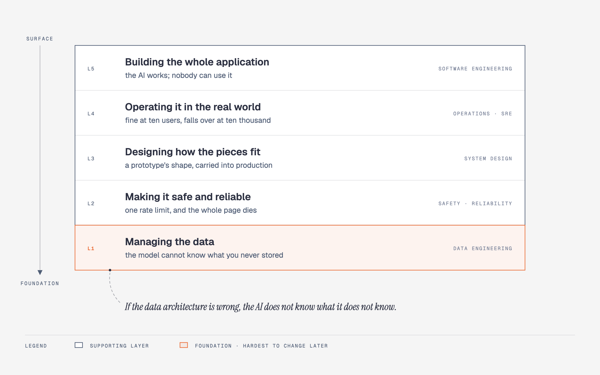
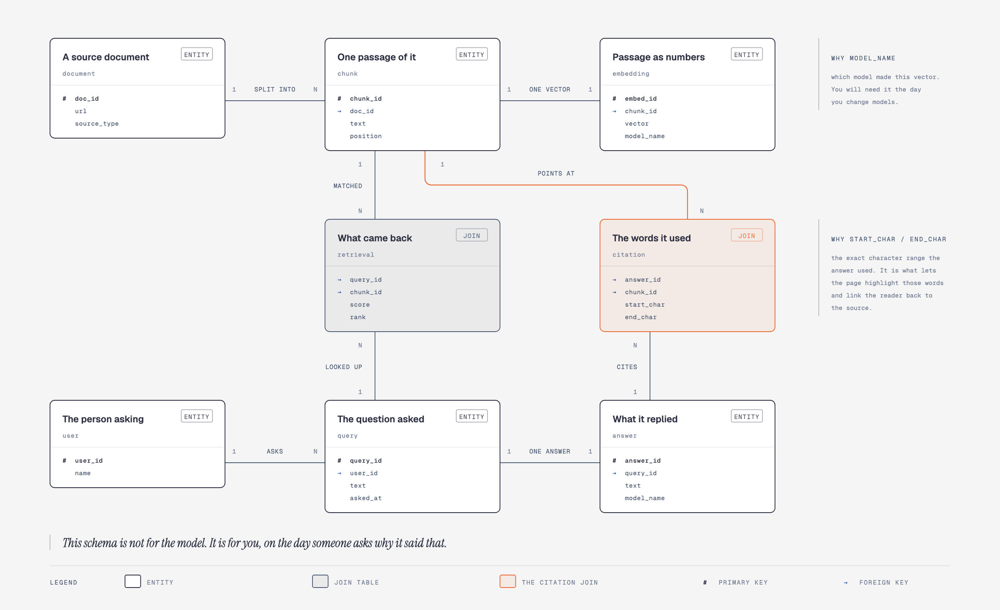

# The Model Is the Easy Half

**How an AI system actually works, explained twice: once in plain English, once in the words engineers use.**

You do not need to know how to code to read this. You do not need to know what a vector is. If you build these systems for a living, the plain half will go quickly, and the boxed vocabulary, the failure notes and the [sources](#sources) are written for you.

There is a working program at the end. One command, no installation, no account, no API key, about one second. It fails three times on purpose, because the failures teach more than the successes do.

---

## Two answers

Here are two answers to the same question. One is true. One has been tampered with.

> **A.** To reset your VPN password, go to `vpn.company.internal` and complete two-factor authentication using the mobile app. `[doc_142]`

> **B.** To reset your VPN password, go to `vpn.company.internal` and complete two-factor authentication using the mobile app. Passwords expire every 45 days, so set a reminder. `[doc_142]`

Same tone. Same confidence. Same source marker. B has one extra sentence that nobody wrote and no document says. The "45 days" is invented. The citation is real, and it is sitting under a sentence it does not support.

Read them again. Nothing in the text tells you which is which.

Now the uncomfortable part: **the system that produced B could not tell either.** Fluency is not evidence. A model with nothing to go on writes in exactly the same voice as a model with the document in front of it, because producing fluent text is the thing it does, and it does that just as well when it is wrong.

Everything below exists to close the gap between those two paragraphs.

---

## The one idea

> **A language model is a very good cook who has never seen your kitchen.**

Ask it for something from general knowledge and it is excellent. Ask what is in your walk-in fridge, what your suppliers charge, or what your staff handbook says about overtime, and it has no idea. It has never been in your building.

What it will not do is say so. It will describe a dish. Confidently. With a garnish.

So the job is not to find a better cook. The job is to build the kitchen around the cook: a stocked pantry, labeled shelves, a runner who fetches the right thing, a written ticket that survives the trip to the pass, and a taster at the end who is not the person who cooked it.

**That kitchen is the subject of this article. The cook is the easy half.**

You are not meant to know these words yet. This is a map to come back to, not a list to learn.

| In the kitchen | In the system | What it does |
|---|---|---|
| The cook | The language model | Turns ingredients into something a person wants |
| Unpacking the delivery | Parsing | Gets readable text out of PDFs, wikis and scans |
| Stocking the pantry | Chunking and indexing | Puts your documents somewhere searchable |
| Labeling by taste, not alphabetically | Embedding | Stores text by what it means, not which words it uses |
| The runner who fetches | Retrieval | Finds the few passages relevant to this question |
| The sous-chef who re-checks the tray | Reranking | Re-orders the shortlist more carefully |
| The written ticket | Serialization | How an order survives being passed between people |
| The taster | Evaluation and verification | Decides whether what came out is made of what went in |
| Who is allowed to reach the pass | Permissions and topology | Which actions the system can physically take |
| Saturday at 8pm | Production | All of the above, under load, when something breaks |

---

## How to read this

Each section explains the idea in ordinary words, shows a picture, then hands you the vocabulary in a box:

> **The words for it.** *Inference* means the model producing an answer. *Context* means the text you paste in front of the question. Nothing more mysterious than that.

**Skip every box and you still get the whole argument.** Read only the boxes and you get the glossary. This is one document for two audiences rather than two documents that quietly disagree.

---

## 1. Stocking the pantry

Before anyone asks anything, your documents have to become searchable. This runs on a schedule, nobody watches it, and it is where most of the quality of the final answer is decided.

### First, and most important: get the text out

A PDF is not text. It is a description of where ink goes on a page. A wiki page is text wrapped in markup. A scanned contract is a picture. Step one throws all of that away and keeps the words.

This step gets one line in most explanations of AI systems, usually a library import. **In production it is the largest single cause of silently bad answers**, and it deserves far more of your attention than the clever parts downstream.

Here is why. A two-column page read straight across interleaves two unrelated sentences. A heading gets separated from the section it governs. A footer is spliced into the middle of a paragraph. Worst of all, a table is flattened: the rows and columns are a two-dimensional structure, and once it has been squeezed into one line of text, the relationship between "Q3" and "$1.2m" is simply gone.

**Nothing downstream recovers this.** A better embedding model will faithfully encode the mangled text. A reranker will faithfully rank it. The retrieval will look healthy, the scores will look reasonable, and the answer will be wrong. Retrieval quality has a ceiling, and that ceiling is extraction quality.

If you take one practical thing from this article: **before tuning anything else, print out what your parser actually produced for twenty of your real documents and read it.** People skip this because it is boring. It is the highest-yield hour available to you.

### Then cut it into passages

You cannot search a 500-page manual as one object, and you cannot paste it into a question. So it is cut into pieces of a few paragraphs. The pieces overlap slightly, so a sentence on a boundary is not sliced in half and lost.

**There is no standard size,** whatever you have read. The figures repeated everywhere (512 tokens, 50 tokens of overlap) are library defaults, not findings. A *token* is the unit these systems count text in: roughly three quarters of a word, so 512 tokens is something like two or three paragraphs. They are traceable to specific lines of library code: LangChain ships a 50-token overlap default in one of its splitters (its base splitter uses 200), and LlamaIndex sets a 1,024-token default chunk size. Defaults are not evidence.

The tradeoff is real in both directions. Chunks too small lose the context that made them meaningful. Chunks too big dilute the meaning, so they match for the wrong reasons. One published evaluation found smaller chunks with no overlap beat the larger, heavily-overlapped default on both recall (how much of the right material you found) and precision (how little junk came with it), which is the opposite of what most tutorials assume. That is one measurement on one corpus (the word for the whole pile of documents your system is allowed to answer from), which is exactly the point: **the number is a property of your documents, and the only way to know it is to build a small set of 50 to 100 real questions and measure.** Tuning it by argument is how everyone does it and it does not work.

### Then label each passage by meaning, and put it on a shelf

That is the next section. Here is the whole shape:

<picture>
  <source media="(prefers-color-scheme: dark)" srcset="diagrams/png/two-planes-dark.png">
  
</picture>

The step in the middle of both halves, "turn it into numbers", is the one that needs explaining, and it gets the whole of section 2. For now, one sentence is enough: every passage, and every incoming question, gets converted into a long list of numbers, and things that mean similar things end up with similar lists. That is what makes the shelf searchable.

**Two machines, one shared shelf.** The top half runs on a schedule and may take hours. The bottom half runs once per question and has about a second. They are built differently, they fail differently, they are usually owned by different people, and they meet in exactly one place.

That single meeting point is also the most dangerous thing in the diagram:

> **Both halves must turn text into numbers using the same model.** Upgrade the one that labels your documents, forget the one that labels incoming questions, and the two are no longer speaking the same language.

Nothing crashes. There is no error. Here is the mechanism, and it is worth understanding precisely: the comparison step is arithmetic on two lists of numbers, and **it will compare any two lists of the same length.** It does not know, and cannot know, that they came from different models. It returns a number. The number is meaningless. Every answer quietly gets worse, forever, until somebody notices months later.

This is what "silent failure" means, and it is the theme of the whole article. **The dangerous failures in AI systems are the ones that still return a plausible answer.**

Two more of the same family, both extremely common, neither ever drawn on a diagram:

**Deletion does not propagate.** Legal retracts a policy document and deletes it from the source system. Six weeks later your assistant is still quoting it to customers, with a citation, because the delete reached the source and never reached the passages, the lists of numbers made from them, or the index. The retracted document is not detectably different from valid evidence. It looks exactly like a good answer.

**Nobody built a write path.** Ingestion was a notebook someone ran once. Then the documents start changing daily and the only operation that exists is "rebuild everything", which takes hours, costs real money, and serves a half-populated index the entire time it runs. This is decided on day one, by treating the index as a thing you build rather than as a view that has to be kept fresh.

> **The words for it.** The top half is the *ingestion* or *indexing pipeline*, and it runs *offline*. The bottom half is the *query path* or *read path*, and it runs *online*. Getting text out of documents is *parsing* or *extraction*. Cutting it up is *chunking*; the deliberate repetition is *overlap*. The whole pattern is **RAG**, retrieval-augmented generation. The stale-document problem is *index drift*.

---

## 2. Labeling by meaning instead of by words

Here is the problem in one example.

Your handbook says:

> *Reset your VPN password at vpn.company.internal.*

Someone types:

> *How do I recover my network credentials?*

These mean the same thing and share **no words at all.** Not "reset", not "VPN", not "password". A system matching on words will not find this passage, and will confidently return something that does share words, like an expense policy about recovering costs for network events.

So instead of storing the words, you store a description of the meaning: a long list of numbers, produced by a model trained so that text meaning similar things gets similar numbers. Do this for every passage. When a question arrives, produce the same kind of list for it, and find the stored lists closest to it.

"Closest" is arithmetic, not metaphor. Each list is a point. Similar meanings land near each other. Finding the right passage becomes finding nearby points.

<picture>
  <source media="(prefers-color-scheme: dark)" srcset="diagrams/png/words-vs-meaning-dark.png">
  
</picture>

**The demo fails at exactly this, on purpose.** It counts words instead of using a real meaning model, so you can watch it retrieve the wrong passage for that exact question and see what the real thing buys you.

> **The words for it.** The list of numbers is an *embedding* or a *vector*. The model is an *embedding model*. Comparing two of them is *cosine similarity*, which reports how much the two lists point in the same direction, on a scale from -1 to 1. When the lists have been scaled to a standard length, which most models do, cosine similarity is arithmetically identical to a *dot product*, and gives the same ranking as straight-line distance. So the choice of comparison usually matters much less than people imply.

**Four things people get wrong here.**

**The number of numbers is not fixed.** You will see "768 dimensions" written as though it were a constant. It is not. 768 is the width of BERT-base and the open sentence encoders that popularized it, which is why it reads as canonical. The major commercial APIs default elsewhere: I checked six current model families and their defaults were 384, 768, 1024, 1536 and 3072 depending on the vendor. Several also let you *request* a shorter list, because they are trained so that the first part of the vector is still useful on its own. So the length is set by the model you picked and, increasingly, by what you asked for. **If a source states a dimension without naming a model, it is repeating rather than reporting.**

**Nothing is "physically grouped" anywhere.** It is arithmetic on lists. And the grouping is not a free gift of high-dimensional space, it is a trained behavior: plain BERT is famously unsuitable for similarity search, which is why Sentence-BERT had to exist.

**There is a hard capacity ceiling, and it is provable.** Recent work from Google DeepMind and Johns Hopkins shows the number of distinct top-k document sets a single vector per document can express is bounded by the dimension of that vector. Beyond that limit, no amount of training helps, and their test set defeats state-of-the-art models despite the task being simple. This is a real, structural limit on how much a single embedding can be asked to do.

**Meaning-based search is not strictly better.** It is better at synonyms and worse at exact strings. Ask for part number `X-4419-B`, a surname, or an error code, and a system that only understands meaning will return something semantically adjacent and wrong. It also handles negation badly.

Which is why serious systems run **both** kinds of search and fuse the results. Anthropic's published evaluation of this puts numbers on it: on a top-20 retrieval task, a baseline failed 5.7% of the time; adding generated context to each chunk before embedding took that to 3.7%; adding keyword search as well took it to 2.9%; adding a reranking pass took it to 1.9%. Each step is real, and no single one is the whole story: the first buys 2.0 points, the second 0.8, the third 1.0. The stack is worth more than any move inside it.

> **The words for it.** Meaning-based search is *dense retrieval*; keyword search is *sparse* or *lexical* retrieval, usually *BM25*. Running both and merging them is *hybrid search*, and the standard merge is *Reciprocal Rank Fusion*, from a 2009 paper, which combines rankings using only rank position and never the raw scores, so it can fuse two systems whose scores are not comparable. Adding generated context to each chunk before indexing is Anthropic's *Contextual Retrieval*.

---

## 3. What happens in that one second

<picture>
  <source media="(prefers-color-scheme: dark)" srcset="diagrams/png/query-lifecycle-dark.png">
  
</picture>

**1. Turn the question into numbers.** Same model as the pantry. See above, twice.

There is a wrinkle nobody mentions: the question is short and the passage is long, and a question is not written like an answer. They do not sit naturally in the same neighbourhood. And a follow-up like *"what about last year?"* means nothing on its own. In production, rewriting the question before searching is not a refinement, it is load-bearing.

**2. Grab the nearest passages.** Compare the question's point against the stored points and take the closest few. Except you cannot compare against all of them: at scale that is millions of comparisons per question and you have a second.

So you use an *index*: a structure built in advance that lets you jump to roughly the right neighborhood without visiting everything. It is the aisle sign in the supermarket. You do not walk every shelf, you read the sign and go straight there, and you accept that very occasionally the thing you wanted was shelved somewhere odd. It is genuinely *approximate*. The paper that introduced the most common one says so outright: it relaxes exact search "by allowing a small number of errors", and the fraction of true nearest neighbours you actually get back has a name, recall. **That is a dial you set, traded against speed, not a fact you inherit.** Turn it far enough one way and you are back to checking everything.

Worth knowing: this is also why adding a search index changes your results. The database's own documentation warns that queries return different answers after an approximate index is added. That is not a bug.

**3. Re-check the shortlist properly.** Step 2 is fast and slightly careless: it compared the question and the passage separately, having never seen them side by side. Step 3 takes the survivors and scores them again with a slower model that reads the question and the passage *together*, which is a much better judge and far too expensive to run on everything.

How much slower is worth knowing, because it is often understated. Published throughput figures for common rerankers on a datacenter GPU work out to roughly 10 milliseconds for the smallest distilled model over 100 passages, and roughly 300 milliseconds for a base-sized one. Tens to hundreds of milliseconds, not "a few". On a CPU, or through a hosted API, more. This is a real budget line, and it is the step that gets quietly dropped under load.

**4. Paste them in.** The passages go above the question with instructions: answer from these and nothing else, cite which one, and if the answer is not here, say so.

**5. Write the answer.** The cook cooks.

**6. Check the answer is made of them.** Take it apart sentence by sentence and confirm each traces back to a passage actually retrieved on this request.

**Almost every explanation stops at step 5.** Step 6 decides whether you can ship, and it gets section 5 to itself.

> **The words for it.** Step 2 is *approximate nearest neighbour* search, built with an index structure such as *HNSW* or an *IVF* variant. The handful you take is the *top-k*. Step 3 is *reranking*; the careful scorer is a *cross-encoder* (reads both texts in one pass), the fast one from step 2 is a *bi-encoder* (reads each alone). Step 4 is *augmentation*, the A in RAG. Rewriting the question first is *query rewriting* or *query expansion*.

**Two things about the numbers you will see quoted.**

*"Sub-300 milliseconds" is measuring the wrong thing.* That figure is reasonable for the retrieval half. It is not attainable for most paths that include a language model writing prose, because generation is the dominant term rather than a rounding error on top of retrieval. One published end-to-end breakdown puts it at roughly three quarters to nine tenths of total query latency (latency being the delay between asking and getting an answer). If you see a sub-300ms figure quoted, ask what was in the timer, and time retrieval, reranking and generation separately on your own traffic before believing any split, including that one.

*p95 does not mean "usually fast".* It means one request in twenty is worse than that, with no promise about how much worse. And it is 5% of *requests*, not users. Once one user action fans out across several stages, those diverge sharply: the classic illustration is that if a request touches 100 services each with a one-in-a-hundred slow response, **63% of user requests are slow.** A retrieval pipeline is itself a fan-out.

---

## 4. The written ticket

This section is not about AI. It is here because it is where real systems break, and because no explainer of AI systems includes it.

Your data does not stay put. It crosses from a page to a service, to another service, to a database and back. At every crossing it is written down as text and read back. That writing down is the ticket.

<picture>
  <source media="(prefers-color-scheme: dark)" srcset="diagrams/png/order-ticket-dark.png">
  
</picture>

Nearly every system on the internet writes those tickets in the same format, called **JSON**. Think of it as the docket format every station has agreed to read. It is simple, it is everywhere, and it has three gaps that bite.

**A big number arrives changed.** JSON has one kind of number and no separate whole-number type. That is usually harmless, but when a browser reads it, the number becomes a form with about 15 to 16 reliable digits. Feed it a 19-digit identifier and the last digits round. No error. The ID becomes a different, entirely valid-looking ID.

This is not hypothetical. Twitter hit it when their identifiers moved to 64-bit values, and the documented fix was to send every ID a second time as text: their own docs tell developers to always use the string field, "due to the way Javascript and other languages that consume JSON evaluate large integers".

You can reproduce it in one line, using the exact example from Twitter's own documentation:

```console
$ node -e "console.log(JSON.parse('{\"id\":10765432100123456789}').id)"
10765432100123458000
```

Nineteen digits went in. A different nineteen-digit number came out. No warning.

**Money stored as a fraction drifts.** Computers store fractions in binary, and `0.1` has no exact binary form, the way `1/3` has no exact decimal form. The famous example is that `0.1 + 0.2` gives `0.30000000000000004`. The example that actually costs money is smaller and nastier: `4.35 * 100` evaluates to `434.99999999999994`, so the ordinary "convert dollars to cents" step truncates it to `434`, and a $4.35 line item bills as $4.34. Money is counted in whole cents, as integers, or in a decimal type built for it. Never as a fraction.

**There are no dates.** JSON has four basic kinds of value (text, number, true/false, and nothing-at-all) and a date is not one of them. Every timestamp you have passed between two services was a string both sides agreed to read the same way. When one side changes its mind about time zones, nothing breaks loudly.

**And the worst one is not about writing at all.** A service writes a record successfully, then times out before it can say so. The write happened. The confirmation did not. The caller retries, or gives up, or marks it failed, and now two systems disagree about reality. The encoding was perfect. The state is wrong.

> **The words for it.** The format is *JSON* (RFC 8259). The number limit is *IEEE 754 double precision*, and JavaScript names the boundary `Number.MAX_SAFE_INTEGER`, which is 9,007,199,254,740,991. Note this is a JavaScript property rather than a JSON rule: the spec deliberately lets implementations differ, and Python, Go and Java can all preserve those digits. Dates go in as strings in the *RFC 3339* format. The timeout problem is *partial failure*, and its specific shape here is the *dual-write problem*; the defenses are *idempotency* (a retry cannot double-apply) and the *transactional outbox*. Letting old and new versions of a service coexist while fields change is *schema evolution*, and it has two directions people routinely conflate: *backward* compatible means new consumers can read old data, *forward* compatible means old consumers can read new data. The second is harder, and it is the one a rolling deployment needs.

**Why this belongs in an article about AI.** An AI system is a data pipeline with a model bolted into the middle. Every one of these failures happens *inside* it, and they are worse there, because a normal program given corrupted input tends to crash, while an AI system given corrupted input writes you a fluent paragraph about it.

---

## 5. The taster cannot be the cook

Back to the two paragraphs at the top. You could not tell them apart. Nor could the system. So how does anyone ever know?

**The first instinct is to ask the model to check its own work.** This does not do what people hope. A model that misunderstood the question while writing misunderstands it the same way while checking, because it is the same understanding. There is no second, better opinion held in reserve.

This has been measured, and the result is worse than "no help". In a controlled study, GPT-3.5 asked to review and revise its own reasoning, without being told when it was right, went from 75.9% to 74.7% on grade-school math across two rounds, and collapsed from 75.8% to 38.1% on a commonsense benchmark. When it did change an answer, it was more likely to break a correct one than to fix a wrong one. The versions of this that appear to work are the ones quietly given the correct answer to stop at, which is not a technique so much as a description of already having the answer.

**The second instinct is to ask a different model.** This is genuinely better, and it is how much evaluation works. But be honest about what it is: a second opinion, not a measurement. Models used as judges have documented, reproducible biases:

- **Position bias.** In MT-Bench, the study that popularized the method, swapping which answer came first changed the verdict most of the time. Consistency was 23.8% for Claude-v1, 46.2% for GPT-3.5 and 65.0% for GPT-4. Naming them matters: the worst number there belongs to a Claude model, and rounding that off would be exactly the convenient omission this article is about.
- **Verbosity bias.** Padding an answer with rephrased duplicates that add no information fooled Claude-v1 and GPT-3.5 91.3% of the time. GPT-4 fell for it 8.7% of the time. So this is a bias to measure on your judge, not a law about judges.
- **Self-preference.** Judges appear to score their own output higher: in that same study GPT-4 by 10 points of win rate, Claude-v1 by 25. Do not lean hard on it, because the authors say plainly that their own data could not establish the effect. Separate later work found models can recognize their own writing, which is the mechanism the bias would need.

Judges are still useful. The rule is simply that you name the judge and version, use a different model family from the generator (a separate API call to the same model is not independence), and stop reporting the output as though it were a measurement with no error bar.

**The thing that settles it is a check against something that cannot argue back.**

<picture>
  <source media="(prefers-color-scheme: dark)" srcset="diagrams/png/chef-and-taster-dark.png">
  
</picture>

For a retrieval system that thing is sitting right there: **the passages you retrieved.** Every factual sentence either traces back to one or it does not. That is mechanical, not a judgement, and it cannot be talked round.

Other anchors, depending on what you built: a test that actually executed. Code that compiled or did not. A number that reconciles against the ledger. A filing you can open. The common property is that **the anchor was not produced by the thing being checked, and it is capable of saying no.**

### The missing answer

There is a failure hiding underneath all of this, and it is the most common one in production.

**The system always returns something.** Ask for the top five passages and you get five, whether or not your documents contain the answer at all. There is no "not found". The generator then writes a fluent, confident, completely wrong response out of five irrelevant passages, and every part of the machinery reports success.

The obvious fix, refusing to answer below some similarity score, works less well than you would hope: those scores separate relevant from irrelevant passages far too weakly for a single global cutoff to be safe. **Which is why the grounding check in step 6 is doing more work than it appears to.** It is not only catching invented sentences. It is the mechanism by which the system is able to say "I don't know", which is a correct answer that most of these systems are structurally incapable of giving.

> **The words for it.** Checking the answer is supported by the retrieved text is *faithfulness* or *groundedness*. In the most common open-source framework, faithfulness has a precise definition: the number of claims in the answer supported by the retrieved context, divided by the total number of claims. Whether retrieval found the right passages is *context precision* and *context recall*. Note that context precision is a **ranking** metric (did the good passages come back near the top) and not the share of retrieved passages that were relevant, which is how it is usually described. Using one model to score another is *LLM-as-a-judge*. Declining to answer is *abstention*.

### About the numbers you will see

Articles on this print target figures: faithfulness of 0.88, retrieval precision of 0.90, "93% grounded", "p95 of 249ms". **Those are screenshots of somebody's dashboard, not benchmarks.**

I went looking for a published standard that establishes them. There is not one, from any standards body or any of the frameworks that define these metrics, and there could not be: what counts as good depends on your documents, your questions, and what it costs you to be wrong. A legal research tool and a recipe finder should not share a bar. For scale, the nearest real published measurement I could find, a controlled biomedical study, reports *contextual precision* (a different framework's metric, not the one just defined) between 0.671 and 0.852 across five retrieval strategies, and its best result sits *below* the 0.90 those articles present as a target.

**Measure yours. Do not adopt a screenshot as a goal.** And when you report a number, report the judge model, the sample size, and the date, or it is not a measurement.

### The general form

> **Generation got cheap. Verification did not.** The cost of producing plausible output collapsed. The cost of establishing whether it is correct did not move. Every hard problem in applied AI right now lives in that gap.

This goes far beyond retrieval. A test suite written by the same agent that wrote the code encodes the same misunderstanding twice and then reports green. A review by the model that wrote the diff inherits the diff's assumptions. Working code that came from a good decision and working code that came from a terrible one look identical on screen, and nothing prompts you to ask which you have.

None of this is new, which is reassuring. Software engineering named the problem in 1982: a program is *non-testable* when no oracle exists to say whether the output is right. The established answer to "are my tests any good" is *mutation testing*, deliberately breaking the code to see whether the suite notices, introduced in 1978 and validated against real faults since. **The oldest ideas in testing turn out to be the ones that transfer.**

---

## 6. A gate is a shape, not a sentence

Suppose your system can send email and you would like a human to approve each one. So you write in the instructions: *always ask the user before sending.*

That is not a gate. It is a request.

Everything the system reads arrives as text, and it cannot reliably separate *instructions from you* from *text it found in a document*. If a retrieved passage contains a sentence aimed at the system rather than the reader, that sentence lands in the same channel as your rules, competing with them.

This is the top-ranked security risk for AI applications, two editions running, and the standard itself is unusually blunt about the state of play: given how these models work, "it is unclear if there are fool-proof methods of prevention". Its recommended controls are structural, not textual: least privilege, human approval for high-risk actions, and separating untrusted content.

**It happens for real.** ConfusedPilot, published research against Microsoft 365 Copilot, showed two things working in a shipped enterprise product: text planted in an ordinary business document corrupting the answers Copilot then gave other people, and confidential data leaking through the retrieval cache. The person who typed the query was not the attacker. The attacker had written a document weeks earlier, and nobody had to open it.

<picture>
  <source media="(prefers-color-scheme: dark)" srcset="diagrams/png/gate-is-topology-dark.png">
  
</picture>

The version that works removes the capability rather than discouraging its use. The system writes a draft. A person sends it. There is no path from the model to the send button, so no sentence in any document can talk its way onto one.

**The test is structural, and you can run it on your own system this afternoon:** if the risky action were attempted right now, what physically stops it? If the honest answer is "the instructions say not to", you have a hope, not a control.

Two more that are less obvious and worth knowing.

**Check-then-act is a race.** If the system verifies you may see a record and acts on it a moment later, and the record can change in between, the check was performed on something other than the thing acted upon. The permission was real and it was still wrong. This is an old, named bug class, and it has now been measured specifically in AI agents: one study found 12% of executed agent runs carried it.

**Permission filtering breaks search in a way nobody warns you about.** Filter the index by who is allowed to see what *before* searching and you damage the structure the search relies on, and recall drops. Filter *after* searching and the user silently gets two results instead of five, with no error anywhere. Enterprise diagrams draw this as a box. It is not a box.

> **The words for it.** Hostile text arriving through retrieved content is *indirect prompt injection*, ranked LLM01 in the OWASP Top 10 for LLM Applications. Designing so an action is unreachable rather than discouraged is *least privilege*, applied to topology. The check-then-act race is *time-of-check to time-of-use*, TOCTOU, catalogued as CWE-367 and considerably older than any of this.

---

## 7. The five things underneath

Everything so far is the AI-specific part. It sits on top of ordinary software, and if that is weak, none of it survives contact with real users.

Andrew Ng's framing is the clearest available, and worth taking seriously precisely because it is unglamorous. To be exact about the attribution, because it is easy to get wrong: his skills map names **four** top-level skills, and *software engineering fundamentals* is one of them. The five headings below are the list he gives inside that one branch, in a follow-up letter devoted to it. The headings are his. The failures attached to each are mine.

Here is each one with the specific thing that breaks when it is missing. Not a category. The actual incident.

<picture>
  <source media="(prefers-color-scheme: dark)" srcset="diagrams/png/five-fundamentals-dark.png">
  
</picture>

**Building the whole application.** The prototype calls the model, waits nine seconds and prints. Put it behind a web address and two things happen the same afternoon: long answers hit the gateway's 30-second timeout, and users give up at four seconds because the screen is blank. Fixing it means streaming the answer out word by word, which is not a feature you add but a rewrite of the request path: what happens when the user closes the tab, what you do with half an answer, whether a retry bills twice. The team that skipped this also never built "stop", so a user who walks away keeps paying for words nobody will read.

**Designing how the pieces fit.** The shape you chose to get a demo working in a weekend is still the shape nine months later, and it is why every change now takes three weeks. The specific version for these systems: the index was treated as a thing you build once rather than a view that must be kept fresh, so there is no update path, only "rebuild everything".

**Making it safe and reliable.** A dependency starts rate-limiting you, the retry loop has no backoff so it amplifies the load, and the whole page dies instead of degrading. Meanwhile the health check is green throughout, because it pings a static endpoint rather than asking a real question.

**Operating it in the real world.** Fine at ten users. At ten thousand, the thing that falls over first is never what you expected, and you hear it from a customer rather than a dashboard. Your measured latency was taken on an idle machine, where it is service time; under load it is mostly queue wait, and the two are unrelated. Then the bill arrives at many times forecast and cannot be attributed to any feature, because nobody recorded cost per request against anything traceable.

**Managing the data.** The foundation, the hardest thing to change later, and the one with a distinctive AI failure mode. Your system's knowledge is whatever you stored. Store the wrong things, or store them in a shape that cannot answer the questions people actually ask, and the model has no way to know anything is missing. It answers from the incomplete picture with total confidence.

> **The AI does not know what it does not know.** Everything else on this list produces an error you can see. This one produces an answer.

**On what changed with coding agents.** None of this became less important. Writing the code got cheap, so the value moved to deciding what to build and noticing when what came back is subtly wrong. An agent will happily pick a tradeoff you did not know existed, between speed and consistency, or cost and reliability, and the code it hands back looks the same either way. Knowing the tradeoffs exist is the job now. Typing is not.

One popular claim deserves a correction, because it is repeated confidently and the primary source says the opposite. You will read that the essential new skill is orchestrating many coding agents in parallel. Anthropic's own published engineering write-up on multi-agent systems measures a large win **on research**, where the work genuinely splits into independent directions, and states plainly that most coding tasks contain fewer truly parallel pieces and that models are not yet good at coordinating each other in real time. It also puts a price on it: agents use around 4x the tokens of a chat, and multi-agent systems around 15x. **Parallelism is a tool with a measured cost and a measured domain, not a general skill upgrade.**

---

## 8. What you have to write down

None of this is debuggable unless you kept records. When someone asks "why did it say that?", the answer lives in tables you decided to create months earlier.

<picture>
  <source media="(prefers-color-scheme: dark)" srcset="diagrams/png/what-to-store-dark.png">
  
</picture>

Most of it is obvious once drawn. Two columns are not, and they are the two that matter.

**Store which model made each vector.** The day you change embedding models, this column is the difference between "re-index everything" and "re-index the 40% that is stale". Without it you cannot tell which is which, and as section 1 explained, the comparison will not tell you either. It will just return a number.

**Store the character range of every citation.** Not "this answer cites chunk 4,412", but "characters 220 to 294 of this answer came from that chunk". That range is what lets an interface highlight the exact sentence and let a reader click through. It is also what turns "the answer was wrong" into "chunk 4,412 scored 0.71, ranked second, and should never have been in the shortlist".

> **The words for it.** The join table between queries and chunks is your *retrieval log*, and it is the single most useful thing you can keep. The character range is a *span* or *offset*. Together they give you *traceability*: the ability to reconstruct, after the fact, exactly which inputs produced a given output.

A *schema* is just the list of tables you keep and what goes in each column. **This one is not for the model. It is for you, on the day someone asks why it said that.**

---

## 9. When this is the wrong tool entirely

Worth saying plainly, because articles about retrieval rarely do.

The example that opens almost every explanation of this subject, including the one that prompted this article, is: *"ask an LLM (a large language model, the cook) about your company's Q3 revenue and it cannot answer."* True. But **retrieval over prose is the wrong fix for that question.**

Q3 revenue lives in a table, in a database, and the right system computes it: turn the question into a database query, run it, return the number. What you get instead from a similarity search over documents is the paragraph that most *resembles* a question about revenue, which is not the same thing as the revenue, and may be last year's.

The honest decision rule is simple:

| If the answer is | Use |
|---|---|
| A fact stated in prose somewhere in your documents | Retrieval, as described above |
| A number that has to be computed from records | A database query, generated from the question |
| Small enough to simply show the model in full | Just show it in full, and skip all of this |
| Not written down anywhere | Nothing. Go and write it down first |

That last row is not a joke. A meaningful share of retrieval projects are attempts to extract knowledge that was never recorded. No architecture recovers it.

---

## 10. Run it yourself

Everything above, as a program you can execute right now. No installation, no account, no key, no network. Standard library only.

```bash
git clone https://github.com/wilsonwu-ai/the-model-is-the-easy-half.git
cd the-model-is-the-easy-half
python3 demo/tiny_rag.py
```

It runs all six stages against a small invented staff handbook, then fails three times on purpose.

**What is real in it:** chunking with overlap, the scaling of vectors, the similarity comparison, the ranking, a reranking pass that genuinely reorders results, and the grounding check. Those are the real mechanisms in miniature.

**What is faked, and labeled as fake on every line that fakes it:** it counts words instead of using a trained embedding model, and it stitches sentences instead of using a language model. Both fakes are load-bearing. They are why it runs anywhere in a second, and the first one produces the most instructive output in the file.

### Failure A: the synonym miss

Ask the handbook, in different words, something it plainly answers:

```
  Question: "how do I recover my network credentials"
  The right answer is in HB-01#0: To reset your VPN password, open the Access
                                  Portal and choose Reset Password.

  Content words in the question: credentials, network, recover
  Words in common              : (none -- checked, not assumed)

  rank chunk      cosine    text
  1    HB-04#0    0.1325    The company provides a laptop, a monitor, and a...
  tie  HB-01#0    0.0000    To reset your VPN password, open the Access Por...

  The right chunk HB-01#0 scored 0.0000, and so did 12 of 13 chunks. It is not
  ranked second, it is UNRANKED -- which is why the table prints 'tie'.
```

A person sees one question asked twice. The word counter sees zero overlap, so the correct passage scores exactly zero and **cannot be ranked above anything at all.** It returns the equipment policy instead, on the strength of the single shared word "network", and nothing anywhere signals that it missed.

That is section 2 happening in front of you. Note what a better model does *not* fix: parsing, chunking, reranking, citation and checking are all still your problem. It buys you one box in the diagram.

### Failure B: the invented fact

The same answer with one sentence spliced in by hand. Try to spot it before reading on:

```
  - Any expense above five hundred dollars requires written approval from
    your manager before you spend the money. [HB-06]
  - Written approval above five hundred dollars is returned within fourteen
    days. [HB-06]
  - Approval limits: five hundred dollars for an expense, five thousand
    dollars for equipment. [HB-09]
```

Same register, same citation format, same confidence. Then the check runs:

```
  verdict      source   sentence
  COVERED      HB-06#0  Any expense above five hundred dollars requires w...
  NOT COVERED  --       Written approval above five hundred dollars is re...
                missing from closest chunk (HB-06#0): within, fourteen, days
                of those, absent from the whole handbook: fourteen

  ANSWER REJECTED. 1 of 3 sentences failed the check.
```

"Fourteen days" is a deadline that exists nowhere in the handbook. It is the most useful-sounding thing in the answer and the only thing that is false. Those are the two paragraphs from the top of this article, and the check is the only thing that separated them.

Notice the second line of the verdict, because it is the honest part. The words "within" and "days" *are* in the handbook. The check only ever compares against the chunks that were actually retrieved on this request, and none of the three had them. Only "fourteen" was invented outright. One unfamiliar word was enough.

### Failure C: the lie the check cannot catch

This is the one that matters most, and it is why the demo does not end at B. Both of these sentences are false:

```
  - Approval is not requested in the Expense Portal. [HB-06]
  - Approval limits: five thousand dollars for an expense, five hundred
    dollars for equipment. [HB-09]

  verdict      source   sentence
  NOT COVERED  --       Approval is not requested in the Expense Portal. ...
  COVERED      HB-09#0  Approval limits: five thousand dollars for an exp...
```

The first inverts a policy and is caught, but only because the word "not" was deliberately kept out of the stopword list. **A checker that discards negations cannot tell a rule from its opposite.**

The second one passes, and it has to. It swaps the two limits, so anyone acting on it overspends by a factor of ten. It passes because this is a *set* test: word order, repetition, and which number belongs to which noun are all thrown away before it runs, and every individual word of that sentence really is in the cited chunk.

So the check catches invented **facts** and misses invented **relationships**. That is a precise, demonstrable limit, printed by the program itself rather than asserted in prose.

**Which is exactly the point.** It is a correctness filter, not a security boundary. Anyone who can see the retrieved passages can write a passing falsehood out of their vocabulary in a minute. A real system puts a trained entailment model in this slot and inherits that model's error rate instead. What makes even this version worth having is that it **fails closed**: what it cannot confirm is rejected, never waved through. A filter that waves through what it does not understand is decorative.

### The tests

```bash
python3 -m unittest discover -s demo -v
```

Thirty-two tests, all passing, and several of them are unusual on purpose:

- one asserts that the synonym search **fails**, so a known weakness cannot quietly become an unknown one
- one asserts the verifier marks nothing as grounded when the retrieved context is empty, which is the fail-closed rule as a test
- one asserts that the reranker's reordering is real rather than narrated, so a future edit cannot flatten it into a no-op while the demo still prints "ranks 1 and 2 swapped"
- one checks the printed narration is actually true of the corpus, because a teaching transcript that drifts from its own data is worse than no transcript

Section 5 argues that the way to find out whether tests are any good is to break the code deliberately and see whether they notice. That was done here rather than recommended: an independent reviewer mutated the source in nine ways (reranker turned into a no-op, verifier made to fail open, the stable hash swapped for the randomized one, normalization dropped, ranking reversed, overlap removed) and **every mutant was caught.** If the suite had been decorative, that is where it would have shown.

There is also [`demo/real_rag.py`](demo/real_rag.py), which shows the same six steps with real components. It does not run as written, and is not meant to: you supply the embedding model and the store, and the generation call needs a key. Its purpose is to show that swapping the fake parts for real ones changes almost nothing about the shape of the pipeline. The plumbing is the same, which is the argument of this whole article.

## 11. Where this article could be wrong

The rule I hold myself to is to concede the limits before anyone has to ask.

**What I did, and what that is worth.** Every substantive claim from the source material was checked against a primary source: the paper, the RFC, the vendor's own documentation, the library's code. Those corrections then went through a second pass told to refute rather than agree. Ten went through it; five survived and five were rewritten.

Be careful how much that buys. Section 5 argues that one model checking another is a second opinion rather than a measurement, and most of that second pass was exactly that. What makes the numbers here worth more than an opinion is that each is linked to a source you can open, and several were settled by execution rather than by reading: the floating-point examples, the identifier rounding, and the demo's own printed transcript were all run, not quoted.

**What I removed rather than repeated.** The source material stated target figures for retrieval precision, faithfulness, grounded-answer rate and p95 latency. I could not find a published basis for any of them and have said so rather than passing them along. It also contained an embedding dimension that contradicted its own code sample, a reranking latency roughly an order of magnitude optimistic, and a code example setting a parameter that current models reject outright.

**What the review of the demo turned up, including the parts I would rather not report.** Four reviewers attacked the program with instructions to break it. Three findings are worth repeating because they are the article's own thesis landing on the article:

- **The synonym failure was fake the first time.** With a smaller vector, two unrelated words collided into the same slot by accident, and the correct document surfaced at the top for a reason that had nothing to do with meaning. The demo would have printed a confident, wrong lesson. It was caught by checking the number rather than trusting the narration.
- **The grounding check passed a policy inversion.** The word "not" was being discarded as a common word before comparison, so a sentence asserting the exact opposite of a document was marked as supported. That is now fixed, and the demo prints the fix as its third deliberate failure.
- **The corpus is engineered.** The document that loses the reranking comparison was written so that it would lose it. The swap is genuine and pinned by a test, but it was designed to occur rather than discovered, and you should read it as an illustration rather than as evidence.

**What is thinly covered.** Cost barely appears here, and it is a real design constraint: embedding a large corpus, reranking, and running judges over production traffic are all line items. Multi-turn conversation is one paragraph. What happens when two retrieved passages contradict each other, or when retrieval contradicts what the model already believes, is not covered at all, and it is a genuine open problem.

**What has a shelf life.** Model names, dimensions, prices and vendor defaults all move. The mechanisms should outlast them; the specifics will not. Where I gave a number, I tried to give its source so you can check whether it still holds.

**Where I could be wrong and would want to know.** The strongest claim here is that verification, not generation, is the binding constraint in applied AI. That is well supported for the cases I cite and it is still an argument rather than a proof. If you have a counter-example, [open an issue](https://github.com/wilsonwu-ai/the-model-is-the-easy-half/issues).

---

## Sources

Grouped by what each one actually supports, so you can check the specific claim rather than the general topic.

**The source material this article was built from**

- Andrew Ng, [The AI Engineering Skills Map In Detail: Software Engineering Fundamentals](https://www.deeplearning.ai/the-batch/the-ai-engineering-skills-map-in-detail-software-engineering-fundamentals) (DeepLearning.AI, The Batch, 28 August 2026). The five headings in section 7, verbatim, and the line "the AI doesn't know what it doesn't know", which is his.
- Andrew Ng, [The AI Engineering Skills Map](https://www.deeplearning.ai/the-batch/the-ai-engineering-skills-map/) (14 August 2026). The parent map, which names four top-level skills. Software engineering fundamentals is one of them; the letter above is the follow-up that expands it.
- [LangChain text splitters](https://github.com/langchain-ai/langchain/tree/master/libs/text-splitters) and [LlamaIndex](https://github.com/run-llama/llama_index). The chunk-size and overlap defaults quoted in section 1, read off the code rather than a blog post.
- The RAG architecture walkthrough, the serialization thread, and the reply threads on agentic coding that prompted sections 4, 5 and 6, all originally posted on X in August 2026.

**Retrieval and embeddings**

- Malkov & Yashunin, [Efficient and robust approximate nearest neighbor search using HNSW graphs](https://arxiv.org/abs/1603.09320). The approximate-search tradeoff, in the authors' own words: it "relaxes the condition of the exact search by allowing a small number of errors."
- Reimers & Gurevych, [Sentence-BERT](https://arxiv.org/abs/1908.10084). Why usable similarity search is a trained property rather than a free one, and the bi-encoder versus cross-encoder distinction.
- Weller, Boratko, Naim & Lee, [On the Theoretical Limitations of Embedding-Based Retrieval](https://arxiv.org/abs/2508.21038) (Google DeepMind / JHU). The capacity ceiling: which top-k sets a single vector per document can express is bounded by its dimension.
- Kusupati et al., [Matryoshka Representation Learning](https://arxiv.org/abs/2205.13147). Why a shortened vector still works, and therefore why dimension is increasingly a request parameter.
- Cormack, Clarke & Büttcher, [Reciprocal Rank Fusion outperforms Condorcet and individual Rank Learning Methods](http://cormack.uwaterloo.ca/cormacksigir09-rrf.pdf) (SIGIR 2009). The standard way to merge keyword and meaning-based rankings. Its constant of 60 is an empirical default from a pilot, not a derived value.
- Sciavolino, Zhong, Lee & Chen, [Simple Entity-Centric Questions Challenge Dense Retrievers](https://arxiv.org/abs/2109.08535) (EMNLP 2021). Dense retrieval failing on exact entities.
- Thakur et al., [BEIR](https://arxiv.org/abs/2104.08663). Zero-shot retrieval across domains, and why one benchmark number does not transfer.
- Anthropic, [Contextual Retrieval](https://www.anthropic.com/engineering/contextual-retrieval). The 5.7% to 3.7% to 2.9% to 1.9% failure-rate sequence in section 2. Note these are relative reductions on an already low base.
- Anthropic, [Embeddings](https://platform.claude.com/docs/en/build-with-claude/embeddings). "Anthropic does not offer its own embedding model", verbatim, plus the recommendation to evaluate vendors yourself.
- [pgvector](https://github.com/pgvector/pgvector). That you do not need a dedicated vector database, the six distance operators, and the warning that results change once an approximate index is added.
- [FAISS index documentation](https://github.com/facebookresearch/faiss/wiki/Faiss-indexes). The IVF family, and cosine handled by normalizing first.
- [Sentence-Transformers cross-encoder documentation](https://sbert.net/docs/pretrained-models/ce-msmarco.html). The throughput table behind the reranking latency figures in section 3, measured on a datacenter GPU.
- Chroma, [Evaluating Chunking Strategies for Retrieval](https://www.trychroma.com/research/evaluating-chunking). One measured comparison of chunk sizes, including the result that the popular large-chunk default underperforms.
- Gao et al., [Retrieval-Augmented Generation for Large Language Models: A Survey](https://arxiv.org/abs/2312.10997). Chunking practice, hierarchical indexing, and the field's own vocabulary.
- Barnett et al., [Seven Failure Points When Engineering a RAG System](https://arxiv.org/abs/2401.05856). Missing content answered confidently, which is failure point one.

**Evaluation and verification**

- Zheng et al., [Judging LLM-as-a-Judge with MT-Bench and Chatbot Arena](https://arxiv.org/abs/2306.05685) (NeurIPS 2023). Judge agreement with humans, and the position and verbosity bias numbers in section 5.
- Wang et al., [Large Language Models are not Fair Evaluators](https://arxiv.org/abs/2305.17926). Reordering two answers changes the verdict.
- Panickssery, Bowman & Feng, [LLM Evaluators Recognize and Favor Their Own Generations](https://arxiv.org/abs/2404.13076) (NeurIPS 2024). Self-preference.
- Huang et al., [Large Language Models Cannot Self-Correct Reasoning Yet](https://arxiv.org/abs/2310.01798) (ICLR 2024). The numbers behind "the taster cannot be the cook".
- Es et al., [RAGAS: Automated Evaluation of Retrieval Augmented Generation](https://arxiv.org/abs/2309.15217), and the [metric definitions](https://docs.ragas.io/en/stable/concepts/metrics/available_metrics/faithfulness/). Where "faithfulness" and "context precision" actually come from, and what context precision really measures.
- Weyuker, [On Testing Non-Testable Programs](https://academic.oup.com/comjnl/article/25/4/465/366384) (The Computer Journal, 1982). The oracle problem, named forty years before anyone needed it for this.
- DeMillo, Lipton & Sayward, Hints on Test Data Selection (IEEE Computer, 1978), and Just et al., [Are Mutants a Valid Substitute for Real Faults?](https://dl.acm.org/doi/10.1145/2635868.2635929) (FSE 2014). Mutation testing, and how well it stands in for real defects.
- Dean & Barroso, [The Tail at Scale](https://www.barroso.org/publications/TheTailAtScale.pdf) (CACM, 2013). The fan-out arithmetic behind the p95 warning in section 3.
- Bal & Puhan, [Benchmarking Retrieval Strategies for Biomedical RAG: A Controlled Empirical Study](https://arxiv.org/abs/2605.02520). The context precision range of 0.671 to 0.852 in section 5, and a worked example of judge and generator being the same model, which its authors flag themselves.
- [RAGPerf: An End-to-End Benchmarking Framework for Retrieval-Augmented Generation Systems](https://arxiv.org/abs/2603.10765). The per-stage latency breakdown showing generation dominating total query time.

**Agents and safety**

- OWASP, [LLM01:2025 Prompt Injection](https://genai.owasp.org/llmrisk/llm01-prompt-injection/). Top-ranked two editions running, and candid that fool-proof prevention is unclear.
- Debenedetti et al., [CaMeL: Defeating Prompt Injections by Design](https://arxiv.org/abs/2503.18813) (Google, DeepMind, ETH Zurich). Structural defense rather than better wording.
- [ConfusedPilot: Compromising Enterprise Information Integrity with Copilot for M365](https://arxiv.org/abs/2408.04870). Injection through ordinary business documents, in a shipped product.
- MITRE, [CWE-367 Time-of-check Time-of-use](https://cwe.mitre.org/data/definitions/367.html), and Lilienthal & Hong, [TOCTOU Vulnerabilities in LLM-Enabled Agents](https://arxiv.org/abs/2508.17155). Including the measured 12% of agent runs.
- Asai et al., [Self-RAG](https://arxiv.org/abs/2310.11511) (ICLR 2024); Yan et al., [Corrective RAG](https://arxiv.org/abs/2401.15884); Yao et al., [ReAct](https://arxiv.org/abs/2210.03629) (ICLR 2023); and the [Agentic RAG survey](https://arxiv.org/abs/2501.09136). What the retry loop in section 3 looks like when it is done properly, and the fact that deciding "this is not enough" is a trained or external capability rather than something an unaided model does well.
- Anthropic, [How we built our multi-agent research system](https://www.anthropic.com/engineering/multi-agent-research-system). The measured research win, the explicit caution about coding, and the roughly 4x and 15x token costs.

**Data and serialization**

- [RFC 8259](https://www.rfc-editor.org/rfc/rfc8259.txt) (JSON), and [RFC 3339](https://www.rfc-editor.org/rfc/rfc3339.txt) section 5.6 (the date format JSON does not have).
- ECMA-262, [Number.MAX_SAFE_INTEGER](https://tc39.es/ecma262/multipage/numbers-and-dates.html#sec-number.max_safe_integer). 9,007,199,254,740,991.
- Twitter developer documentation, [Twitter IDs](https://web.archive.org/web/20170819194357/https://dev.twitter.com/overview/api/twitter-ids-json-and-snowflake) (archived). The string-twin fix, and the reason for it.
- Python, [decimal module documentation](https://docs.python.org/3/library/decimal.html). Why money is not a float, from the standard library's own rationale.
- Confluent, [Schema Evolution and Compatibility](https://docs.confluent.io/platform/current/schema-registry/fundamentals/schema-evolution.html), and Protocol Buffers, [Updating A Message Type](https://protobuf.dev/programming-guides/proto3/#updating). Backward versus forward compatibility, and why field numbers are the identity on the wire.
- Apache Kafka, [Message Delivery Semantics](https://kafka.apache.org/documentation/#semantics), and Chris Richardson, [Transactional Outbox](https://microservices.io/patterns/data/transactional-outbox.html). The half-updated-state problem and its standard defenses.

---

## What is in this repository

```
README.md                 this article
demo/tiny_rag.py          the runnable demo: six stages, three deliberate failures
demo/test_tiny_rag.py     32 tests, including one that asserts a failure
demo/real_rag.py          the same six steps with real components
diagrams/*.html           the eight diagrams, light and dark, self-contained
diagrams/svg/             scalable exports
diagrams/png/             what the README embeds
tools/export_diagrams.py  regenerates svg/ and png/ from the HTML
```

## Corrections

If something here is wrong, [open an issue](https://github.com/wilsonwu-ai/the-model-is-the-easy-half/issues). Corrections with a primary source attached will be applied and credited.

## License

[CC BY 4.0](LICENSE) for the writing, [MIT](LICENSE-CODE) for the code. Use either freely, including commercially.

---

*Every number here is checked against the source linked beside it, and where I could not find a source I have said so instead of rounding to something that sounded right. Everything framed as "should" is an opinion, offered to be argued with.*
